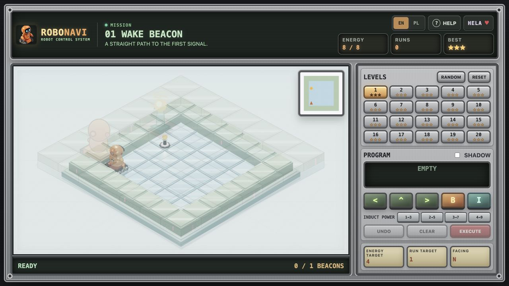

# RoboNavi

[](https://github.com/xsub/RoboNavi/actions/workflows/ci.yml)
[](https://xsub.github.io/RoboNavi/)

RoboNavi is an isometric robot-programming puzzle game for learning sequencing,
planning, and debugging. Build a command queue, predict the route, and then run
the whole program.

**[Play RoboNavi in your browser](https://xsub.github.io/RoboNavi/)**



## Features

- 20 hand-authored levels with progressively larger boards
- Procedural levels with configurable size, route count, and wall density
- Dijkstra validation and A* reference programs for generated boards
- Forward, left, right, beacon-battery, and inductive-charge programming
- Floor, walls, sand, ice, charging stations, and signal beacons
- Optional route preview without a ghost robot
- Energy and execution targets with three-star scoring
- Full-screen confetti celebration after the final beacon
- A 60-second beacon-network countdown after the first battery is installed
- English and Polish interface
- Desktop and mobile layouts
- Local progress saved in the browser

## Controls

- `<`, `^`, `>`: add turn-left, forward, and turn-right commands
- `B`: install a battery while standing on an unfinished beacon
- `I`: inductively charge while standing on a charging station (`I1` by default)
- `1`-`4` after `I`: invest 1-4 energy and receive 3, 5, 7, or 9 energy
- `UNDO`: remove the last command
- `CLEAR`: empty the command queue
- `EXECUTE`: run the program
- `RANDOM`: open the procedural generator
- Keyboard: `L`, `F`, `R`, `B`, `I`, `1`-`4`, arrow keys, `Z` or `Backspace`
  to undo, `Enter` to execute, `C` to clear, and `X` to reset the level

## Local Development

The game has no build step. Open `index.html` directly or start a local server:

```bash
npm run dev
```

Then open [http://localhost:4173](http://localhost:4173).

## Tests

```bash
npm test
```

The test suite validates syntax, all campaign reference solutions, terrain
behavior, Dijkstra route counting, A* programs, generated levels, and energy
reserves. GitHub Actions runs it on every push to `main` and on every pull
request.

## Procedural Generator

`RANDOM` creates a new board instead of selecting an existing campaign level.
The generator pipeline:

1. Builds a weighted grid and places walls and sand.
2. Uses Dijkstra to verify reachability and count shortest routes.
3. Rejects boards below the selected minimum route count.
4. Uses A* over position and robot orientation to find the optimal command
   program.
5. Sets the energy target from the A* result and adds a practical battery
   reserve above that optimum.
6. Stores the seed and search metadata on the generated level for deterministic
   testing.

## Deployment

The public build is served by GitHub Pages:
[xsub.github.io/RoboNavi](https://xsub.github.io/RoboNavi/).
